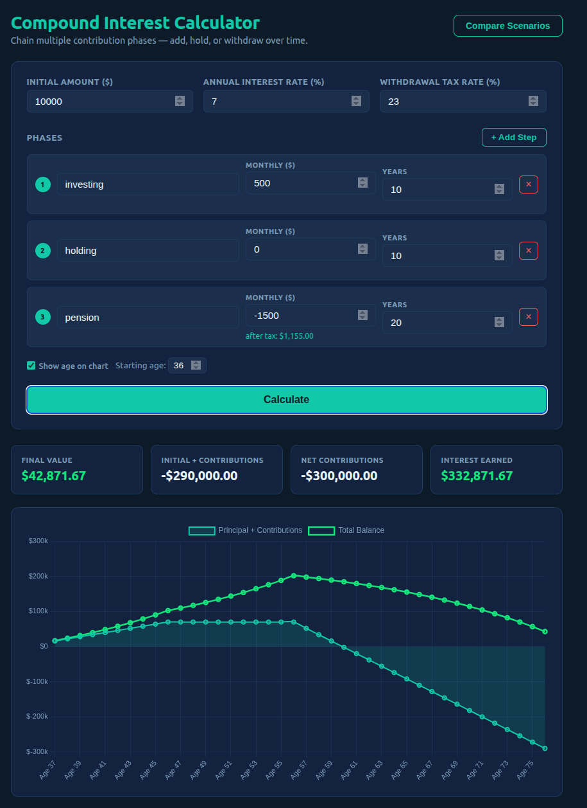

# Multistep Compound Calculator

A client-side compound interest calculator for modeling multi-phase investment and withdrawal strategies.

## Features

- **Multi-phase modeling** — chain contribution phases sequentially (e.g., "save for 10 years, withdraw for 20")
- **Compound interest** — annual compounding with configurable interest rate
- **Withdrawal tax rate** — shows after-tax net on negative contributions
- **Age tracking** — toggle chart labels between year numbers and ages
- **Compare mode** — visualize up to 3 scenarios side-by-side
- **Negative balance warning** — alerts when withdrawals exceed available funds

## Screenshots

**Compare mode** — run up to 3 scenarios side-by-side:

